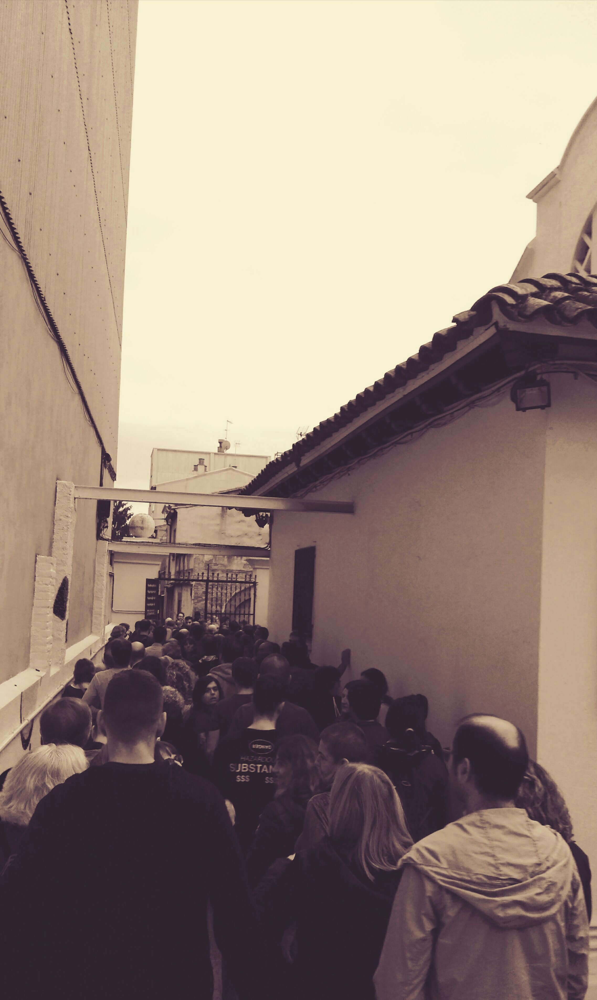

El primer d’Octubre de 2017. Una crònica de moltes victòries
=============================================================

Intento explicar els detalls de com vaig viure 26 hores que no oblidaré
mai. La història deu ser semblant a la de milers de persones que hem
servit a les meses electorals del referèndum que ens portarà a la
República Catalana.

{width="80.00000%"}

20:00 (-1)

:   Parlem amb la gent a “Aulos” per coordinar-nos per l’endemà. El més
    important, dur cafè! Ens n’anem cap a casa per preparar-nos per la
    nit. Hi ha dos col·legis que estan tancats durant la nit: “Aulos” i
    “Les Escoles”. S’han de protegir a partir de les 5h, però no té
    sentit fer nit a fora. Decidim que dormirem a “Saltells”, una escola
    que sí que està oberta.

20:50 (-1)

:   Sortim de casa per anar al col·legi “Saltells”. Agafem sacs de
    dormir, jocs de taula, menjar i aigua. No agafem ni coixins ni
    màrfegues, per mandra de carregar-ho. I 24 hores més tard ens en
    penedirem, clar.

21:10 (-1)

:   A “Saltells” hi ha unes 30 persones, de totes les edats. Hi ha un
    grupet de nois i noies de 17 a 19 anys amb la il·lusió de la primera
    vegada, i també hi ha gent gran i molt gran. Ens expliquen que a les
    22h tancaran les portes i només es deixarà entrar a algú que es
    pugui identificar directament amb un dels qui està dins. D’aquesta
    manera, s’evitaran problemes amb possibles infiltrats. Mentrestant,
    sopem i xerrem una mica amb la gent.

21:40 (-1)

:   L’alcalde i la primera tinent d’alcalde ens passen a veure. Estan
    fent una ronda per totes les escoles que “organitzen activitats”,
    per donar-nos ànims. L’alcalde agafa a dues de les persones que eren
    allà i els dóna consignes que es queden en secret. Sembla que hi ha
    gent que sap què s’ha de fer, els altres hi confiem.

22:20 (-1)

:   Ens visita algú més proper a l’organització. De seguida es fa una
    rotllana al seu voltant i ens explica el pla. Diu que estem en una
    barca plena de vies d’aigua i que anem remant com podem. Ens explica
    que ens caldran ordinadors i dispositius mòbils perquè s’ha decidit
    fer servir el cens universal. Per tant, no hi haurà llistes de cens
    als col·legis electorals. La gent s’ofereix voluntària a dur
    ordinadors i tablets (a Saltells en calen 5). Ens dóna ànims i se’n
    va.

22:50 (-1)

:   Recollim i ens preparem els sacs de dormir. La gent no està per
    gresca, alguns més joves es queden fora fent-la petar però a dins hi
    ha gent més gran que ja pensa en anar a dormir. Ens han dit que a
    les 5am s’ha d’estar en peu per protegir el col·legi. Nosaltres
    expliquem que anirem a “Aulos” i “Les Escoles”, perquè hi falta
    gent. Per tant, ens posarem el despertador a les 4am (hem de passar
    per casa a fer cafè).

23:30 (-1)

:   Els llums s’apaguen. Algú encara va mirant el mòbil o la tablet,
    però de mica en mica la gent s’adorm.

3:50

:   Miro l’hora, no he pogut dormir gaire perquè el terra era molt dur.
    La Maria tampoc dorm, així que decidim aixecar-nos i no deixar sonar
    el despertador. Demanem al responsable de la clau que ens obri, i
    ens desitgem sort.

4:30

:   Acabem de fer els cafès. També ens enduem melindros i llet. Al cap
    de poc sortim cap a “Les Escoles”.

4:45

:   Arribem a “Les Escoles”, i ens hi trobem ja una quinzena de
    persones. En pocs minuts n’arriben més, alguns des de “Aulos”, ja
    que allà en són més. De mica en mica es veu que serem suficients.
    Alguns dels qui veiem ja els haviem vist el dia abans. Alguns altres
    han decidit pel seu compte de venir a defensar el seu col·legi
    electoral. Hi veiem gent de la UAB, que vénen amb les seves
    famílies, també. L’edifici segueix tancat, però ens diuen que “algú
    vindrà quan toqui”.

5:20

:   Apareix un noi en bici, es posa entre la gent. Al cap d’uns segons
    torna a marxar, i la porta està oberta. (!). Anava amb caputxa, però
    el reconec. La nit abans estava al “Saltells”.

5:45

:   Arriben els Mossos d’Esquadra. Ens demanen si hi ha algun
    responsable (Resposta: *No, tots “passavem per aquí”*). S’obren pas
    entre nosaltres i ens compten per sobre. Ens diuen que tenen ganes
    de descansar, però que tenen ordres de quedar-se allà fins les 21h.
    Es queden a un costat, fora l’edifici.

6:30

:   Hem instal·lat una taula dins l’edifici, a tocar l’entrada. Hi ha
    termos de cafè, llet, pastes, carquinyolis, i un pastís que una
    senyora ha fet la nit abans –i que està boníssim–. Seguim fent
    temps, tothom està molt animat.

7:30

:   Apareix un cotxe, la gent el rodeja (algú ens està donant ordres a
    través d’un mòbil) perquè els mossos segueixen allà. En surt una
    persona del darrera, carregat amb l’urna. Entra a l’edifici rodejat
    de gent que el protegeix. En surt al cap d’uns moments, i el cotxe
    arrenca i marxa. Tot ha estat molt ràpid, sembla que tot està
    bastant controlat.

7:50

:   Es recullen les taules, i ens fan estar fora de l’edifici. A dins
    només hi ha unes poques persones, i una d’elles (després sabrem qui
    és, però li direm E.) pregunta si hi ha present els presidents i
    vocals de meses. Ningú diu res (s’entén que no s’han rebut les
    notificacions) i E. ens diu que al cap de 15 minuts ho tornaran a
    preguntar i si no surt ningú hauran d’agafar els primers de la cua.
    Jo m’apropo a la porta, quan hi hagi cua seré el primer.

8:05

:   La senyora E. torna a preguntar si hi ha els presidents i vocals de
    mesa, i com que no surten demanen als tres primers de la cua. També
    hi ha tres persones que s’identifiquen com a interventors, i entrem
    tots cap dins. La resta de gent es queda fora l’edifici.

8:10

:   Som dins l’edifici, hi ha la C. (lletrada, representa
    l’administració) i la E. (representa l’ajuntament). I també hi som
    en S., en M. i jo mateix. Els tres interventors, també són amb
    nosaltres. Se’ns explica com funcionarà la constitució de les meses.
    Algú ha de ser el president de mesa, i l’S. (que és el més gran dels
    tres) s’ofereix a ser-ho. També ens expliquen que ens exposem
    (segons la llei espanyola, això sí) a multes de 3000Eur per persona.
    Però que la llei catalana ens protegeix.

8:30

:   Preparem la taula que serà la mesa. Arriben les brides per l’urna (a
    l’entrar encara no les teniem, però les coses van apareixent a
    mesura que les necessitem. És magnífic! Demano a la Maria que vagi a
    buscar l’ordinador a casa, perquè ens farà falta. Em diu que vigili
    molt, que hi tenim una pila de fotos que no tenen còpia de
    seguretat, i al cap de 10 minuts ja el tenim allà.

8:55

:   Estem preparats, falten 5 minuts perquè ens diguin la web que
    s’utilitzarà per comprovar els DNI. Estem tots preparats, i
    il·lusionats amb el dia que ens espera.

9:00

:   Obrim el col·legi, hi ha una bona de cua de gent que espera ja a
    votar (bàsicament els qui protegien el col·legi). Introduïm les
    dades al navegador, i la clau. Però sembla que no funciona. La
    pàgina no es carrega. Ja ens ho esperavem, perquè comptavem que les
    webs s’atacarien durant tot el dia. Cal una nova IP, però per
    aconseguir-la cal trucar a un telèfon (del Regne Unit). No agafen la
    trucada.

9:15

:   Ja fa un quart d’hora que ho provem, tots els col·legis estan igual.
    Hi ha hagut un col·legi a Cerdanyola que ha pogut ja registrar el
    primer vot, però nosaltres seguim sense sort. No hi ha manera de
    contactar amb qui ens ha de donar (per veu) les claus.

9:55

:   Ens informen que estan imprimint llistes del cens, per fer-les
    servir com a últim recurs. El problema és que ja hi ha qui ha fet
    servir el registre electrònic, i no està clar com es pot coordinar.
    La C. decideix (segueix ordres de la coordinació comarcal) no
    fer-les servir, per ara.

12:00

:   Seguim igual. Hem estat provant tres o quatre webs, després que els
    números de telèfon també hagin anat caient. A fora hi ha una cua
    enorme però la gent s’ho pren amb molta paciència. Els hem deixat
    entrar dins el recinte, perquè es protegissin de la pluja (bastant
    forta) que està caient. Hem anat sortint durant el matí, per
    tenir-los al cas del què passa. Hi ha una dona molt gran que
    necessita ajuda per caminar, i que ve amb la seva cuidadora. Serà la
    primera a votar, quan pugui. Ella no marxa, porta molta estona
    esperant però no marxarà fins que pugui votar.

12:15

:   Finalment hem aconseguit la clau i provem el DNI de la senyora gran.
    Després d’esperar un minut, la pàgina ens retorna que el DNI s’ha
    registrat correctament. I el primer vot es pot emetre! Provem el
    segon DNI, que és el de l’acompanyant d’aquesta senyora. La pàgina
    no respon, i al final decidim que ja tornarà més tard a provar-ho,
    que així pot acompanyar la senyora gran a casa.

13:10

:   Veig un entrepà al costat de la taula. Al reconèixer l’embolcall,
    m’expliquen que me l’ha dut la Maria. No me n’he adonat de res, fins
    llavors. Els tres membres de la mesa hem estat molt ocupats tota
    aquesta estona i no vèiem res que no fossin votants, DNIs i vots.

14:00

:   Durant tota aquesta estona la gent ha pogut votar prou bé. Encara
    queda cua, però el ritme és bo. Portem ja uns 200 vots. Molta gent
    es fa fotos, s’emociona. Es veuen ulls plorosos, gent que vota dient
    “per tú, mama”. Hi ha famílies que vénen amb els fills, que són els
    qui introdueixen els sobres a l’urna mentre els pares immortalitzen
    el moment. Hi ha gent gran, molta. I molta gent ens diu “gràcies pel
    que esteu fent”. Ens han dut cafès i menjar durant el matí, i algú
    ens ha comprat pollastres a l’ast (jo no havia avisat que era
    vegetarià, però la Maria m’ha preparat un entrepà de formatge amb pa
    del dia, boníssim!).

14:30

:   Hem aconseguit gairebé eliminar la cua. Sembla que ara el problema
    comença a ser garantir que hi hagi prou gent al voltant del
    col·legi. Tenim informació filtrada que ens diu que si quan els
    mossos detecten que hi ha menys de 20 persones, desallotjaran el
    col·legi. Es fa una crida a tot Cerdanyola per enviar gent a
    evitar-ho, i aconseguim mantenir prou gent.

15:15

:   Ara sembla que les webs han tornat a caure. Es tornen a formar cues,
    i expliquem a la gent què ha passat al matí, per prevenir-los que
    l’espera pot anar per llarg. Anem provant telèfons que van
    apareixent (en total n’hi ha uns 10) i el full on apuntem les
    diferents IP’s i claus queda tot ple de gargots. La C. és qui
    s’encarrega de les claus, i s’atabala amb tota la llista de telèfons
    que ha d’anar provant. És un drama, però entre tots l’animem.

16:10

:   Ja tornem a estar en marxa! La web que fem servir ara, en comptes de
    demanar login, envia la clau cada vegada que es registra un vot.
    D’aquesta manera, si hem de canviar la IP podrem fer servir la
    mateixa clau (molt intel·ligent!). Per agilitzar l’entrada de les
    dades (ara a més del DNI cal proporcionar l’ID de la mesa i la clau)
    activo el gestor de contrassenyes del navegador. La mecànica és
    fàcil: el votant em dóna el DNI, jo l’introdueixo en el camp
    corresponent, i clico. Al cap d’uns segons hi ha la resposta. A
    vegades cal refrescar la pàgina i tornar-ho a provar. Per provar,
    hem introduït un DNI repetit i el sistema ens ha respost amb un
    missatge en vermell. També hem detectat gent que no era al cens, que
    se n’ha anat sense votar. Un cop validat, el passo a M. perquè
    apunti el DNI al registre de votants. El president, S., deixa
    llavors votar.

16:50

:   Ens arriba de la junta comarcal que la PN ha segrestat algunes
    urnes, i ens recomanen que prenguem mesures. Fem sortir els votants
    i ens tanquem a discutir. La C. creu que hem de salvar els vots (en
    portem uns 430). El possible pla és el següent: traurem els
    precintes de l’urna, posarem tots els vots en una bossa
    d’escombraries, que també precintarem. Estem contactant amb l’amo
    d’un local davant del col·legi perquè deixi que un de nosaltres (de
    la mesa) s’amagui allà per custodiar els vots fins l’hora del
    recompte. El president creu que no ho hauriem de fer. En M. i jo
    diem que és millor tenir els vots que no pas malbaratar tot l’esforç
    que tota la gent ha fet fins llavors. Així que per majoria decidim
    obrir l’urna. M. s’endú la bossa d’escombraries junt amb altres
    coses per dissimular, i ja no el veurem més fins les 20h. A S. i a
    mi ens tocarà treballar més les hores que falten. Tornem a obrir i
    deixem passar els votants. Un d’ells està molt nerviós i diu que què
    és això de fer esperar tant. És l’excepció del dia, tothom ha estat
    molt comprensible amb la situació.

17:35

:   La gent va votant, algú ens pregunta si hem tingut problemes, diem
    que estem controlant la situació. No expliquem res sobre l’urna més
    buida, però la gent no pregunta massa. Torna a venir més gent, i el
    sistema electrònic està funcionant prou bé. Sembla ser que en alguns
    col·legis han fet servir les llistes de cens (a les 10 del matí,
    veient que el sistema informàtic fallava, s’han imprès aquestes
    llistes però al nostre col·legi la C. s’ha negat a fer-les servir.
    Hauria desligitimat el vot, ja que no es podia prevenir el vot
    duplicat). A la nit m’assabentaré que hi ha hagut alguns col·legis
    que han tirat pel dret, és una llàstima.

18:45

:   Més veus que està a punt d’entrar la PN. Jo estic molt nerviós,
    deixem entrar molts pocs votants a la sala on hi ha la mesa. Està
    arribant el moment més crític de la jornada.

19:40

:   Falten 20 minuts, ve encara gent que treballava i que arriba a
    última hora. Una mare du un nen de mesos al carregador. Unes noies
    que sembla que s’han decidit a última hora. Un grup de joves que fa
    cara de pocs amics i que fa que omplim la sala amb la gent que està
    encara protegint el col·legi, per evitar possibles moments de
    tensió. S’apropen els quatre (tres nois, una noia) a la mesa i ens
    dónen els DNI. Per la cara que fan, sembla que ens hagin de tirar
    l’urna a terra i destrossar l’ordinador. Però no, el DNI es registra
    com a vàlid, voten i marxen.

20:00

:   Ens tanquem amb clau dins la sala. L’últim vot s’ha emès a les
    19:55, una noia que estava contentíssima perquè havia arribat a
    temps. Ara toca l’escrutini sense que entri ningú. A fora s’hi
    agrupa un munt de gent que ens ha de protegir. Apareix M. amb la
    saca. Tot en orde.

20:15

:   Ens posem a fer l’escrutini. El primer que fem és desprecintar la
    bossa i abocar els vots dins l’urna una altra vegada. Comprovem que
    no queda cap sobre a la bossa. Fem el recompte de vots, i ens en
    falta un. Al segon recompte trobem un vot sense sobre que s’havia
    quedat entre dos sobres. En total, 517 vots emesos. Ens repartim la
    feina d’anar obrint sobres i els anem disposant en tres piles: Sí,
    No i Blanc. Els nuls els deixem a part. Ens trobem un Sí clar on a
    més s’ha escrit “Por tí, mamá. Por tí, papá.”. Ens fa pena que acabi
    essent nul, però què hi farem. Un altre posa: “Rajoy y Puigdemont,
    dimisión”. Hi ha algú que ha escrit “Sí” dins el requadre del Sí,
    aquest el comptarem vàlid. Al final, 433 Sí, 59 No, 9 nuls i 16
    blancs.

20:52

:   Acabem de tancar les actes. La gent ens protegeix a fora. Hem
    d’esperar que els altres col·legis acabin. L’objectiu és arribar a
    l’ajuntament amb les actes, i ens fa por que hi hagi algú infiltrat
    que les intenti agafar. La C. les du amagades sota la samarreta, i
    es posa una jaqueta sobre. Els altres col·legis van recollint i es
    van formant columnes de gent, ens hi afegirem quan passin (som
    l’últim col·legi, perquè estem més propers a l’ajuntament). Quan
    arribin, ens barrejarem amb ells. Ningú de fora dels 8 que som a la
    sala sabrà qui du les actes.

21:20

:   Demanarem als de fora que ens protegeixin (sense assenyalar a qui,
    ells ho han de saber perquè ens han estat veient tot el dia, si algú
    s’ha infiltrat a última hora no podrà saber qui som). Obrim la porta
    i sortim tots junts. L’urna (amb els vots escrutinats) es queda
    tancada a la sala, s’ha decidit així a última hora. Ens barregem amb
    la gent, jo em sento molt protegit perquè els voluntaris que s’han
    passat tot el dia amb nosaltres s’apropen. Em noto molt segur, però
    els 8 que érem dins sabem qui du les actes i no li traiem l’ull de
    sobre (tan dissimuladament com podem). Al carrer tot són càntics de
    victòria, també molts “Hem Votat!”, i el “No volem ser…”. Hi ha gent
    als balcons que ens aplaudeix. Som moltíssima gent que està baixant
    pels carrers cap a l’ajuntament. La majoria ha començat la jornada
    davant d’algun col·legi a les 5 del matí, si no abans.

21:35

:   Arribem a la plaça de l’ajuntament. La C. desapareix i sabem que ho
    hem aconseguit: tots els vots de “Les Escoles” s’hauran
    comptabilitzat. L’alcalde fa un discurs i es connecta el senyal de
    Catalunya Ràdio. Em quedo escoltant les paraules de Jordi Cuixart, i
    de cop em vénen ganes de tornar a veure la família.

21:55

:   Arribo a casa. S’ha acabat la jornada, però em costarà molt poder
    trobar el son després d’aquest dia. Posem la televisió i començo a
    veure les imatges que durant el dia havia evitat veure. De mica en
    mica, l’eufòria es comença a convertir en ràbia i tristesa.
    Malauradament, l’espectacle deplorable d’un règim en descomposició
    aclaplararà demà els titulars. Adéu, Espanya. Ni oblit, ni perdó.

Marc.
